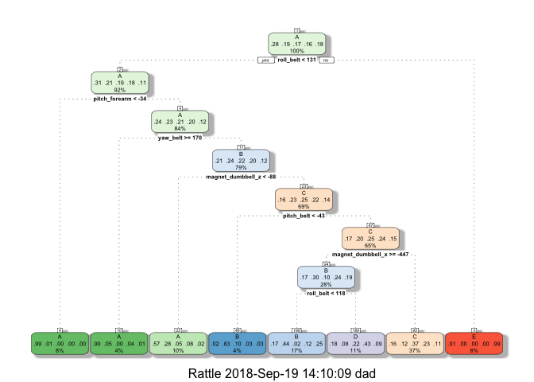
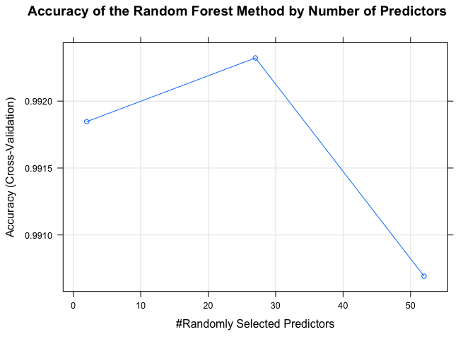
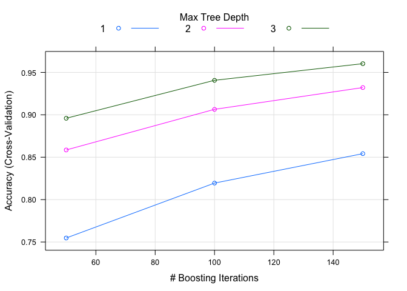

## Background
Using devices such as Jawbone Up, Nike FuelBand, and Fitbit it is now possible to collect a large amount of data about personal activity relatively inexpensively. These type of devices are part of the quantified self movement – a group of enthusiasts who take measurements about themselves regularly to improve their health, to find patterns in their behavior, or because they are tech geeks. One thing that people regularly do is quantify how much of a particular activity they do, but they rarely quantify how well they do it. 

In this project, my goal will be to use data from accelerometers on the belt, forearm, arm, and dumbell of 6 participants. They were asked to perform barbell lifts correctly and incorrectly in 5 different ways. More information is available from the website here: http://groupware.les.inf.puc-rio.br/har (see the section on the Weight Lifting Exercise Dataset).

## Data Background
The training data for this project are available here: https://d396qusza40orc.cloudfront.net/predmachlearn/pml-training.csv

The test data are available here: https://d396qusza40orc.cloudfront.net/predmachlearn/pml-testing.csv

The data for this project come from this source: http://groupware.les.inf.puc-rio.br/har

## Load the Appropriate Libraries
Load the libraries what will be used throughout the analysis


```r
library(caret)
library(rattle)
```

## Load the Data
Read the data files into R and assign data to **trainData** and **testData** variables


```r
trainData <- read.csv(url("https://d396qusza40orc.cloudfront.net/predmachlearn/pml-training.csv"), header = TRUE)
testData <- read.csv(url("https://d396qusza40orc.cloudfront.net/predmachlearn/pml-testing.csv"), header = TRUE)
```

## First Look at Training Data
Take a look at the training data using the **str** function to better understand if data should be removed from rows or columns


```r
str(trainData)
```

```
## 'data.frame':	19622 obs. of  160 variables:
##  $ X                       : int  1 2 3 4 5 6 7 8 9 10 ...
##  $ user_name               : Factor w/ 6 levels "adelmo","carlitos",..: 2 2 2 2 2 2 2 2 2 2 ...
##  $ raw_timestamp_part_1    : int  1323084231 1323084231 1323084231 1323084232 1323084232 1323084232 1323084232 1323084232 1323084232 1323084232 ...
##  $ raw_timestamp_part_2    : int  788290 808298 820366 120339 196328 304277 368296 440390 484323 484434 ...
##  $ cvtd_timestamp          : Factor w/ 20 levels "02/12/2011 13:32",..: 9 9 9 9 9 9 9 9 9 9 ...
##  $ new_window              : Factor w/ 2 levels "no","yes": 1 1 1 1 1 1 1 1 1 1 ...
##  $ num_window              : int  11 11 11 12 12 12 12 12 12 12 ...
##  $ roll_belt               : num  1.41 1.41 1.42 1.48 1.48 1.45 1.42 1.42 1.43 1.45 ...
##  $ pitch_belt              : num  8.07 8.07 8.07 8.05 8.07 8.06 8.09 8.13 8.16 8.17 ...
##  $ yaw_belt                : num  -94.4 -94.4 -94.4 -94.4 -94.4 -94.4 -94.4 -94.4 -94.4 -94.4 ...
##  $ total_accel_belt        : int  3 3 3 3 3 3 3 3 3 3 ...
##  $ kurtosis_roll_belt      : Factor w/ 397 levels "","-0.016850",..: 1 1 1 1 1 1 1 1 1 1 ...
##  $ kurtosis_picth_belt     : Factor w/ 317 levels "","-0.021887",..: 1 1 1 1 1 1 1 1 1 1 ...
##  $ kurtosis_yaw_belt       : Factor w/ 2 levels "","#DIV/0!": 1 1 1 1 1 1 1 1 1 1 ...
##  $ skewness_roll_belt      : Factor w/ 395 levels "","-0.003095",..: 1 1 1 1 1 1 1 1 1 1 ...
##  $ skewness_roll_belt.1    : Factor w/ 338 levels "","-0.005928",..: 1 1 1 1 1 1 1 1 1 1 ...
##  $ skewness_yaw_belt       : Factor w/ 2 levels "","#DIV/0!": 1 1 1 1 1 1 1 1 1 1 ...
##  $ max_roll_belt           : num  NA NA NA NA NA NA NA NA NA NA ...
##  $ max_picth_belt          : int  NA NA NA NA NA NA NA NA NA NA ...
##  $ max_yaw_belt            : Factor w/ 68 levels "","-0.1","-0.2",..: 1 1 1 1 1 1 1 1 1 1 ...
##  $ min_roll_belt           : num  NA NA NA NA NA NA NA NA NA NA ...
##  $ min_pitch_belt          : int  NA NA NA NA NA NA NA NA NA NA ...
##  $ min_yaw_belt            : Factor w/ 68 levels "","-0.1","-0.2",..: 1 1 1 1 1 1 1 1 1 1 ...
##  $ amplitude_roll_belt     : num  NA NA NA NA NA NA NA NA NA NA ...
##  $ amplitude_pitch_belt    : int  NA NA NA NA NA NA NA NA NA NA ...
##  $ amplitude_yaw_belt      : Factor w/ 4 levels "","#DIV/0!","0.00",..: 1 1 1 1 1 1 1 1 1 1 ...
##  $ var_total_accel_belt    : num  NA NA NA NA NA NA NA NA NA NA ...
##  $ avg_roll_belt           : num  NA NA NA NA NA NA NA NA NA NA ...
##  $ stddev_roll_belt        : num  NA NA NA NA NA NA NA NA NA NA ...
##  $ var_roll_belt           : num  NA NA NA NA NA NA NA NA NA NA ...
##  $ avg_pitch_belt          : num  NA NA NA NA NA NA NA NA NA NA ...
##  $ stddev_pitch_belt       : num  NA NA NA NA NA NA NA NA NA NA ...
##  $ var_pitch_belt          : num  NA NA NA NA NA NA NA NA NA NA ...
##  $ avg_yaw_belt            : num  NA NA NA NA NA NA NA NA NA NA ...
##  $ stddev_yaw_belt         : num  NA NA NA NA NA NA NA NA NA NA ...
##  $ var_yaw_belt            : num  NA NA NA NA NA NA NA NA NA NA ...
##  $ gyros_belt_x            : num  0 0.02 0 0.02 0.02 0.02 0.02 0.02 0.02 0.03 ...
##  $ gyros_belt_y            : num  0 0 0 0 0.02 0 0 0 0 0 ...
##  $ gyros_belt_z            : num  -0.02 -0.02 -0.02 -0.03 -0.02 -0.02 -0.02 -0.02 -0.02 0 ...
##  $ accel_belt_x            : int  -21 -22 -20 -22 -21 -21 -22 -22 -20 -21 ...
##  $ accel_belt_y            : int  4 4 5 3 2 4 3 4 2 4 ...
##  $ accel_belt_z            : int  22 22 23 21 24 21 21 21 24 22 ...
##  $ magnet_belt_x           : int  -3 -7 -2 -6 -6 0 -4 -2 1 -3 ...
##  $ magnet_belt_y           : int  599 608 600 604 600 603 599 603 602 609 ...
##  $ magnet_belt_z           : int  -313 -311 -305 -310 -302 -312 -311 -313 -312 -308 ...
##  $ roll_arm                : num  -128 -128 -128 -128 -128 -128 -128 -128 -128 -128 ...
##  $ pitch_arm               : num  22.5 22.5 22.5 22.1 22.1 22 21.9 21.8 21.7 21.6 ...
##  $ yaw_arm                 : num  -161 -161 -161 -161 -161 -161 -161 -161 -161 -161 ...
##  $ total_accel_arm         : int  34 34 34 34 34 34 34 34 34 34 ...
##  $ var_accel_arm           : num  NA NA NA NA NA NA NA NA NA NA ...
##  $ avg_roll_arm            : num  NA NA NA NA NA NA NA NA NA NA ...
##  $ stddev_roll_arm         : num  NA NA NA NA NA NA NA NA NA NA ...
##  $ var_roll_arm            : num  NA NA NA NA NA NA NA NA NA NA ...
##  $ avg_pitch_arm           : num  NA NA NA NA NA NA NA NA NA NA ...
##  $ stddev_pitch_arm        : num  NA NA NA NA NA NA NA NA NA NA ...
##  $ var_pitch_arm           : num  NA NA NA NA NA NA NA NA NA NA ...
##  $ avg_yaw_arm             : num  NA NA NA NA NA NA NA NA NA NA ...
##  $ stddev_yaw_arm          : num  NA NA NA NA NA NA NA NA NA NA ...
##  $ var_yaw_arm             : num  NA NA NA NA NA NA NA NA NA NA ...
##  $ gyros_arm_x             : num  0 0.02 0.02 0.02 0 0.02 0 0.02 0.02 0.02 ...
##  $ gyros_arm_y             : num  0 -0.02 -0.02 -0.03 -0.03 -0.03 -0.03 -0.02 -0.03 -0.03 ...
##  $ gyros_arm_z             : num  -0.02 -0.02 -0.02 0.02 0 0 0 0 -0.02 -0.02 ...
##  $ accel_arm_x             : int  -288 -290 -289 -289 -289 -289 -289 -289 -288 -288 ...
##  $ accel_arm_y             : int  109 110 110 111 111 111 111 111 109 110 ...
##  $ accel_arm_z             : int  -123 -125 -126 -123 -123 -122 -125 -124 -122 -124 ...
##  $ magnet_arm_x            : int  -368 -369 -368 -372 -374 -369 -373 -372 -369 -376 ...
##  $ magnet_arm_y            : int  337 337 344 344 337 342 336 338 341 334 ...
##  $ magnet_arm_z            : int  516 513 513 512 506 513 509 510 518 516 ...
##  $ kurtosis_roll_arm       : Factor w/ 330 levels "","-0.02438",..: 1 1 1 1 1 1 1 1 1 1 ...
##  $ kurtosis_picth_arm      : Factor w/ 328 levels "","-0.00484",..: 1 1 1 1 1 1 1 1 1 1 ...
##  $ kurtosis_yaw_arm        : Factor w/ 395 levels "","-0.01548",..: 1 1 1 1 1 1 1 1 1 1 ...
##  $ skewness_roll_arm       : Factor w/ 331 levels "","-0.00051",..: 1 1 1 1 1 1 1 1 1 1 ...
##  $ skewness_pitch_arm      : Factor w/ 328 levels "","-0.00184",..: 1 1 1 1 1 1 1 1 1 1 ...
##  $ skewness_yaw_arm        : Factor w/ 395 levels "","-0.00311",..: 1 1 1 1 1 1 1 1 1 1 ...
##  $ max_roll_arm            : num  NA NA NA NA NA NA NA NA NA NA ...
##  $ max_picth_arm           : num  NA NA NA NA NA NA NA NA NA NA ...
##  $ max_yaw_arm             : int  NA NA NA NA NA NA NA NA NA NA ...
##  $ min_roll_arm            : num  NA NA NA NA NA NA NA NA NA NA ...
##  $ min_pitch_arm           : num  NA NA NA NA NA NA NA NA NA NA ...
##  $ min_yaw_arm             : int  NA NA NA NA NA NA NA NA NA NA ...
##  $ amplitude_roll_arm      : num  NA NA NA NA NA NA NA NA NA NA ...
##  $ amplitude_pitch_arm     : num  NA NA NA NA NA NA NA NA NA NA ...
##  $ amplitude_yaw_arm       : int  NA NA NA NA NA NA NA NA NA NA ...
##  $ roll_dumbbell           : num  13.1 13.1 12.9 13.4 13.4 ...
##  $ pitch_dumbbell          : num  -70.5 -70.6 -70.3 -70.4 -70.4 ...
##  $ yaw_dumbbell            : num  -84.9 -84.7 -85.1 -84.9 -84.9 ...
##  $ kurtosis_roll_dumbbell  : Factor w/ 398 levels "","-0.0035","-0.0073",..: 1 1 1 1 1 1 1 1 1 1 ...
##  $ kurtosis_picth_dumbbell : Factor w/ 401 levels "","-0.0163","-0.0233",..: 1 1 1 1 1 1 1 1 1 1 ...
##  $ kurtosis_yaw_dumbbell   : Factor w/ 2 levels "","#DIV/0!": 1 1 1 1 1 1 1 1 1 1 ...
##  $ skewness_roll_dumbbell  : Factor w/ 401 levels "","-0.0082","-0.0096",..: 1 1 1 1 1 1 1 1 1 1 ...
##  $ skewness_pitch_dumbbell : Factor w/ 402 levels "","-0.0053","-0.0084",..: 1 1 1 1 1 1 1 1 1 1 ...
##  $ skewness_yaw_dumbbell   : Factor w/ 2 levels "","#DIV/0!": 1 1 1 1 1 1 1 1 1 1 ...
##  $ max_roll_dumbbell       : num  NA NA NA NA NA NA NA NA NA NA ...
##  $ max_picth_dumbbell      : num  NA NA NA NA NA NA NA NA NA NA ...
##  $ max_yaw_dumbbell        : Factor w/ 73 levels "","-0.1","-0.2",..: 1 1 1 1 1 1 1 1 1 1 ...
##  $ min_roll_dumbbell       : num  NA NA NA NA NA NA NA NA NA NA ...
##  $ min_pitch_dumbbell      : num  NA NA NA NA NA NA NA NA NA NA ...
##  $ min_yaw_dumbbell        : Factor w/ 73 levels "","-0.1","-0.2",..: 1 1 1 1 1 1 1 1 1 1 ...
##  $ amplitude_roll_dumbbell : num  NA NA NA NA NA NA NA NA NA NA ...
##   [list output truncated]
```

The training data consists of 19622 observations and 160 columns. However, many columns are missing values, therefore, we will remove those columns from the dataset. Additionally, the first seven columns report data regarding participants and timestamps, neither of which are important to the analysis. Thus, we will also remove the first seven columns.

## Clean Training Data
If a column has at least 90% blank or NA values, we will remove it from the dataset. Recall, we are also removing the first seven columns as well.


```r
removeTrainCol <- which(colSums(is.na(trainData) |trainData=="")>0.9*dim(trainData)[1])
trainDataClean <- trainData[, -removeTrainCol]
trainDataClean <- trainDataClean[,-c(1:7)]
dim(trainDataClean)
```

```
## [1] 19622    53
```

After cleaning, the new training data only has 53 columns.

## First Look at Testing Data
Take a look at the testing data using the **str** function to better understand if data should be removed from rows or columns


```r
str(testData)
```

```
## 'data.frame':	20 obs. of  160 variables:
##  $ X                       : int  1 2 3 4 5 6 7 8 9 10 ...
##  $ user_name               : Factor w/ 6 levels "adelmo","carlitos",..: 6 5 5 1 4 5 5 5 2 3 ...
##  $ raw_timestamp_part_1    : int  1323095002 1322673067 1322673075 1322832789 1322489635 1322673149 1322673128 1322673076 1323084240 1322837822 ...
##  $ raw_timestamp_part_2    : int  868349 778725 342967 560311 814776 510661 766645 54671 916313 384285 ...
##  $ cvtd_timestamp          : Factor w/ 11 levels "02/12/2011 13:33",..: 5 10 10 1 6 11 11 10 3 2 ...
##  $ new_window              : Factor w/ 1 level "no": 1 1 1 1 1 1 1 1 1 1 ...
##  $ num_window              : int  74 431 439 194 235 504 485 440 323 664 ...
##  $ roll_belt               : num  123 1.02 0.87 125 1.35 -5.92 1.2 0.43 0.93 114 ...
##  $ pitch_belt              : num  27 4.87 1.82 -41.6 3.33 1.59 4.44 4.15 6.72 22.4 ...
##  $ yaw_belt                : num  -4.75 -88.9 -88.5 162 -88.6 -87.7 -87.3 -88.5 -93.7 -13.1 ...
##  $ total_accel_belt        : int  20 4 5 17 3 4 4 4 4 18 ...
##  $ kurtosis_roll_belt      : logi  NA NA NA NA NA NA ...
##  $ kurtosis_picth_belt     : logi  NA NA NA NA NA NA ...
##  $ kurtosis_yaw_belt       : logi  NA NA NA NA NA NA ...
##  $ skewness_roll_belt      : logi  NA NA NA NA NA NA ...
##  $ skewness_roll_belt.1    : logi  NA NA NA NA NA NA ...
##  $ skewness_yaw_belt       : logi  NA NA NA NA NA NA ...
##  $ max_roll_belt           : logi  NA NA NA NA NA NA ...
##  $ max_picth_belt          : logi  NA NA NA NA NA NA ...
##  $ max_yaw_belt            : logi  NA NA NA NA NA NA ...
##  $ min_roll_belt           : logi  NA NA NA NA NA NA ...
##  $ min_pitch_belt          : logi  NA NA NA NA NA NA ...
##  $ min_yaw_belt            : logi  NA NA NA NA NA NA ...
##  $ amplitude_roll_belt     : logi  NA NA NA NA NA NA ...
##  $ amplitude_pitch_belt    : logi  NA NA NA NA NA NA ...
##  $ amplitude_yaw_belt      : logi  NA NA NA NA NA NA ...
##  $ var_total_accel_belt    : logi  NA NA NA NA NA NA ...
##  $ avg_roll_belt           : logi  NA NA NA NA NA NA ...
##  $ stddev_roll_belt        : logi  NA NA NA NA NA NA ...
##  $ var_roll_belt           : logi  NA NA NA NA NA NA ...
##  $ avg_pitch_belt          : logi  NA NA NA NA NA NA ...
##  $ stddev_pitch_belt       : logi  NA NA NA NA NA NA ...
##  $ var_pitch_belt          : logi  NA NA NA NA NA NA ...
##  $ avg_yaw_belt            : logi  NA NA NA NA NA NA ...
##  $ stddev_yaw_belt         : logi  NA NA NA NA NA NA ...
##  $ var_yaw_belt            : logi  NA NA NA NA NA NA ...
##  $ gyros_belt_x            : num  -0.5 -0.06 0.05 0.11 0.03 0.1 -0.06 -0.18 0.1 0.14 ...
##  $ gyros_belt_y            : num  -0.02 -0.02 0.02 0.11 0.02 0.05 0 -0.02 0 0.11 ...
##  $ gyros_belt_z            : num  -0.46 -0.07 0.03 -0.16 0 -0.13 0 -0.03 -0.02 -0.16 ...
##  $ accel_belt_x            : int  -38 -13 1 46 -8 -11 -14 -10 -15 -25 ...
##  $ accel_belt_y            : int  69 11 -1 45 4 -16 2 -2 1 63 ...
##  $ accel_belt_z            : int  -179 39 49 -156 27 38 35 42 32 -158 ...
##  $ magnet_belt_x           : int  -13 43 29 169 33 31 50 39 -6 10 ...
##  $ magnet_belt_y           : int  581 636 631 608 566 638 622 635 600 601 ...
##  $ magnet_belt_z           : int  -382 -309 -312 -304 -418 -291 -315 -305 -302 -330 ...
##  $ roll_arm                : num  40.7 0 0 -109 76.1 0 0 0 -137 -82.4 ...
##  $ pitch_arm               : num  -27.8 0 0 55 2.76 0 0 0 11.2 -63.8 ...
##  $ yaw_arm                 : num  178 0 0 -142 102 0 0 0 -167 -75.3 ...
##  $ total_accel_arm         : int  10 38 44 25 29 14 15 22 34 32 ...
##  $ var_accel_arm           : logi  NA NA NA NA NA NA ...
##  $ avg_roll_arm            : logi  NA NA NA NA NA NA ...
##  $ stddev_roll_arm         : logi  NA NA NA NA NA NA ...
##  $ var_roll_arm            : logi  NA NA NA NA NA NA ...
##  $ avg_pitch_arm           : logi  NA NA NA NA NA NA ...
##  $ stddev_pitch_arm        : logi  NA NA NA NA NA NA ...
##  $ var_pitch_arm           : logi  NA NA NA NA NA NA ...
##  $ avg_yaw_arm             : logi  NA NA NA NA NA NA ...
##  $ stddev_yaw_arm          : logi  NA NA NA NA NA NA ...
##  $ var_yaw_arm             : logi  NA NA NA NA NA NA ...
##  $ gyros_arm_x             : num  -1.65 -1.17 2.1 0.22 -1.96 0.02 2.36 -3.71 0.03 0.26 ...
##  $ gyros_arm_y             : num  0.48 0.85 -1.36 -0.51 0.79 0.05 -1.01 1.85 -0.02 -0.5 ...
##  $ gyros_arm_z             : num  -0.18 -0.43 1.13 0.92 -0.54 -0.07 0.89 -0.69 -0.02 0.79 ...
##  $ accel_arm_x             : int  16 -290 -341 -238 -197 -26 99 -98 -287 -301 ...
##  $ accel_arm_y             : int  38 215 245 -57 200 130 79 175 111 -42 ...
##  $ accel_arm_z             : int  93 -90 -87 6 -30 -19 -67 -78 -122 -80 ...
##  $ magnet_arm_x            : int  -326 -325 -264 -173 -170 396 702 535 -367 -420 ...
##  $ magnet_arm_y            : int  385 447 474 257 275 176 15 215 335 294 ...
##  $ magnet_arm_z            : int  481 434 413 633 617 516 217 385 520 493 ...
##  $ kurtosis_roll_arm       : logi  NA NA NA NA NA NA ...
##  $ kurtosis_picth_arm      : logi  NA NA NA NA NA NA ...
##  $ kurtosis_yaw_arm        : logi  NA NA NA NA NA NA ...
##  $ skewness_roll_arm       : logi  NA NA NA NA NA NA ...
##  $ skewness_pitch_arm      : logi  NA NA NA NA NA NA ...
##  $ skewness_yaw_arm        : logi  NA NA NA NA NA NA ...
##  $ max_roll_arm            : logi  NA NA NA NA NA NA ...
##  $ max_picth_arm           : logi  NA NA NA NA NA NA ...
##  $ max_yaw_arm             : logi  NA NA NA NA NA NA ...
##  $ min_roll_arm            : logi  NA NA NA NA NA NA ...
##  $ min_pitch_arm           : logi  NA NA NA NA NA NA ...
##  $ min_yaw_arm             : logi  NA NA NA NA NA NA ...
##  $ amplitude_roll_arm      : logi  NA NA NA NA NA NA ...
##  $ amplitude_pitch_arm     : logi  NA NA NA NA NA NA ...
##  $ amplitude_yaw_arm       : logi  NA NA NA NA NA NA ...
##  $ roll_dumbbell           : num  -17.7 54.5 57.1 43.1 -101.4 ...
##  $ pitch_dumbbell          : num  25 -53.7 -51.4 -30 -53.4 ...
##  $ yaw_dumbbell            : num  126.2 -75.5 -75.2 -103.3 -14.2 ...
##  $ kurtosis_roll_dumbbell  : logi  NA NA NA NA NA NA ...
##  $ kurtosis_picth_dumbbell : logi  NA NA NA NA NA NA ...
##  $ kurtosis_yaw_dumbbell   : logi  NA NA NA NA NA NA ...
##  $ skewness_roll_dumbbell  : logi  NA NA NA NA NA NA ...
##  $ skewness_pitch_dumbbell : logi  NA NA NA NA NA NA ...
##  $ skewness_yaw_dumbbell   : logi  NA NA NA NA NA NA ...
##  $ max_roll_dumbbell       : logi  NA NA NA NA NA NA ...
##  $ max_picth_dumbbell      : logi  NA NA NA NA NA NA ...
##  $ max_yaw_dumbbell        : logi  NA NA NA NA NA NA ...
##  $ min_roll_dumbbell       : logi  NA NA NA NA NA NA ...
##  $ min_pitch_dumbbell      : logi  NA NA NA NA NA NA ...
##  $ min_yaw_dumbbell        : logi  NA NA NA NA NA NA ...
##  $ amplitude_roll_dumbbell : logi  NA NA NA NA NA NA ...
##   [list output truncated]
```

The testing data consists of 20 observations and 160 columns. However, many columns are missing values, therefore, we will remove those columns from the dataset. Additionally, the first column reports data regarding participants, which is not important to the analysis. Thus, we will also remove the first column.

## Clean Testing Data
If a column has at least 90% blank or NA values, we will remove it from the dataset. Recall, we are also removing the first column as well.


```r
removeTestCol <- which(colSums(is.na(testData) |testData=="")>0.9*dim(testData)[1])
testDataClean <- testData[, -removeTestCol]
testDataClean <- testDataClean[,-1]
dim(testDataClean)
```

```
## [1] 20 59
```

After cleaning, the new testing data only has 59 columns.

## Training Dataset: Create Partition
Create a partition of the training dataset


```r
set.seed(12345)
inTrain1 <- createDataPartition(trainDataClean$classe, p=0.75, list=FALSE)
train1 <- trainDataClean[inTrain1,]
test1 <- trainDataClean[-inTrain1,]
dim(train1)
```

```
## [1] 14718    53
```

```r
dim(test1)
```

```
## [1] 4904   53
```

## Testing Three Methods: Classification Tree, Random Forest, and Gradient Boosting Method with Cross-Validation

We will be testing three methods in the following sections: classification tree, random forest, and the gradient boosting method. These methods fall into the technique of supervised learning, which trains a model on known input and output data so that it can predict future outputs. 

We will also use the cross-validation technique with 5 folds to limit the effects of overfitting as well as improve the efficiency of the models. 


```r
library(e1071)
trControl <- trainControl(method = "cv", number = 5)
```

### Training: Classification Tree


```r
methodCT <- train(classe~., data=train1, method="rpart", trControl = trControl)
```

Display the classification tree:


```r
fancyRpartPlot(methodCT$finalModel)
```

<!-- -->

Display the confusion matrix and the model accuracy


```r
trainPred <- predict(methodCT, newdata = test1)
confMatCT <- confusionMatrix(test1$classe, trainPred)
confMatCT$table
```

```
##           Reference
## Prediction   A   B   C   D   E
##          A 870 159 273  88   5
##          B 162 530 214  43   0
##          C  29  36 674 116   0
##          D  46 136 429 193   0
##          E  16 221 224  51 389
```

```r
confMatCT$overall[1]
```

```
##  Accuracy 
## 0.5415987
```

The accuracy of the classification tree method is quite low at approximately 55%. Thus, we can conclude that outcome class is not well predicted by the other predictors.

### Training: Random Forest


```r
methodRF <- train(classe~., data = train1, method="rf", trControl=trControl, verbose=FALSE)
print(methodRF)
```

```
## Random Forest 
## 
## 14718 samples
##    52 predictor
##     5 classes: 'A', 'B', 'C', 'D', 'E' 
## 
## No pre-processing
## Resampling: Cross-Validated (5 fold) 
## Summary of sample sizes: 11776, 11775, 11773, 11774, 11774 
## Resampling results across tuning parameters:
## 
##   mtry  Accuracy   Kappa    
##    2    0.9918466  0.9896855
##   27    0.9923226  0.9902884
##   52    0.9906918  0.9882252
## 
## Accuracy was used to select the optimal model using the largest value.
## The final value used for the model was mtry = 27.
```

Plot the accuracy of the random forest method:


```r
plot(methodRF, main = "Accuracy of the Random Forest Method by Number of Predictors")
```

<!-- -->

Display the confusion matrix and the model accuracy


```r
trainPred2 <- predict(methodRF, newdata = test1)
confMatRF <- confusionMatrix(test1$classe, trainPred2)
confMatRF$table
```

```
##           Reference
## Prediction    A    B    C    D    E
##          A 1394    1    0    0    0
##          B    6  939    4    0    0
##          C    0    2  849    4    0
##          D    0    0   10  794    0
##          E    0    0    2    5  894
```

```r
confMatRF$overall[1]
```

```
##  Accuracy 
## 0.9930669
```

#### Sample and Out of Sample Error

The accuracy of the random forest method is very good at approximately 99%. The out of sample error rate 100-99.31% = 0.69% with cross-validation. Let's see what kind of accuracy the gradient boosting method provides before drawing a final conclusion.

### Training: Gradient Boosting Method


```r
methodGBM <- train(classe~., data = train1, method="gbm", trControl=trControl, verbose=FALSE)
print(methodGBM)
```

```
## Stochastic Gradient Boosting 
## 
## 14718 samples
##    52 predictor
##     5 classes: 'A', 'B', 'C', 'D', 'E' 
## 
## No pre-processing
## Resampling: Cross-Validated (5 fold) 
## Summary of sample sizes: 11775, 11775, 11774, 11773, 11775 
## Resampling results across tuning parameters:
## 
##   interaction.depth  n.trees  Accuracy   Kappa    
##   1                   50      0.7547203  0.6891712
##   1                  100      0.8194732  0.7714678
##   1                  150      0.8541930  0.8154916
##   2                   50      0.8585420  0.8207615
##   2                  100      0.9064419  0.8816013
##   2                  150      0.9321251  0.9141097
##   3                   50      0.8959101  0.8682235
##   3                  100      0.9406855  0.9249385
##   3                  150      0.9603210  0.9497973
## 
## Tuning parameter 'shrinkage' was held constant at a value of 0.1
## 
## Tuning parameter 'n.minobsinnode' was held constant at a value of 10
## Accuracy was used to select the optimal model using the largest value.
## The final values used for the model were n.trees = 150,
##  interaction.depth = 3, shrinkage = 0.1 and n.minobsinnode = 10.
```

Plot the accuracy of the gradient boosting method:


```r
plot(methodGBM)
```

<!-- -->

Display the confusion matrix and the model accuracy


```r
trainPred3 <- predict(methodGBM, newdata = test1)
confMatGBM <- confusionMatrix(test1$classe, trainPred3)
confMatGBM$table
```

```
##           Reference
## Prediction    A    B    C    D    E
##          A 1377   12    6    0    0
##          B   37  878   32    1    1
##          C    0   18  823   12    2
##          D    0    1   26  769    8
##          E    2   10   12   14  863
```

```r
confMatGBM$overall[1]
```

```
##  Accuracy 
## 0.9604405
```

The accuracy of the gradient boosting method is very good at approximately 96%, however, this accuaracy value is less than the random forest accuracy value of approximately 99%.

## Conclusion

The random forest method is best method since it has an accuracy of approximately 99%. Therefore, we will use this method to predict the values of classe for the test data.


```r
finalTestPred <- predict(methodRF, newdata=testDataClean)
finalTestPred
```

```
##  [1] B A B A A E D B A A B C B A E E A B B B
## Levels: A B C D E
```


